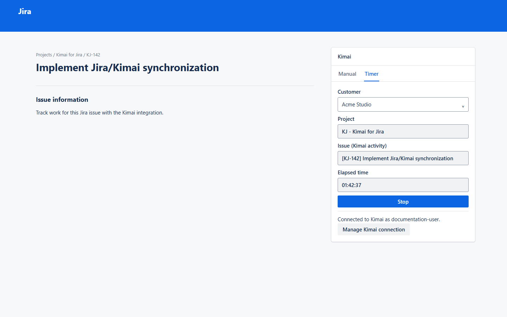
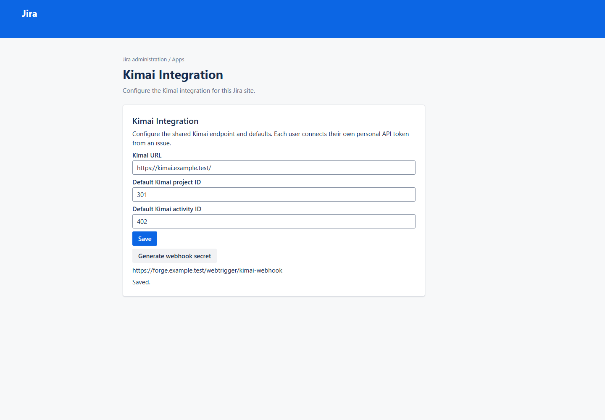

# Kimai for Jira

Open-source [Atlassian Forge](https://developer.atlassian.com/platform/forge/) app that
integrates Jira Cloud worklogs with a self-hosted [Kimai](https://www.kimai.org/) instance:
a timer and manual time entry inside the Jira issue view, with two-way synchronization between
Jira worklogs and Kimai timesheets.

Full documentation (installation, configuration, architecture, development, security, ...) lives
under [`/docs`](docs/index.md) and is published at
<https://jacksonpradolima.github.io/kimai-jira/>.

## Quick start (development)

```bash
git clone https://github.com/jacksonpradolima/kimai-jira.git
cd kimai-jira
npm ci
npm run lint
npm run typecheck
npm test
```

None of the above require production Forge credentials or access to a real Kimai/Jira site. To
run the app against your own free Atlassian developer environment, see
[docs/development.md](docs/development.md):

```bash
npx forge login
npx forge register kimai-for-jira
npx forge deploy
npx forge install --demo-site
```

## UI Preview

The UI gallery is generated from the same Forge UI Kit view components used by the app. See
[the complete UI documentation](docs/ui/README.md) for every state and regeneration details.

| Running timer | Administration |
| --- | --- |
|  |  |

## Status

Early-stage, MVP-focused. See [`docs/architecture.md`](docs/architecture.md) and
[`docs/synchronization-model.md`](docs/synchronization-model.md) for the current design, and
[`CHANGELOG.md`](CHANGELOG.md) for release history.

## Contributing

See [`CONTRIBUTING.md`](CONTRIBUTING.md).

## Security

See [`SECURITY.md`](SECURITY.md).

## License

[MIT](LICENSE)
