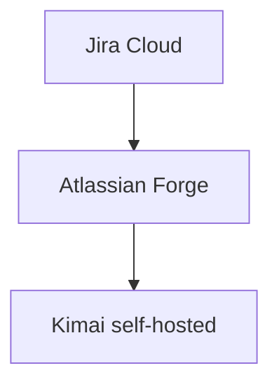
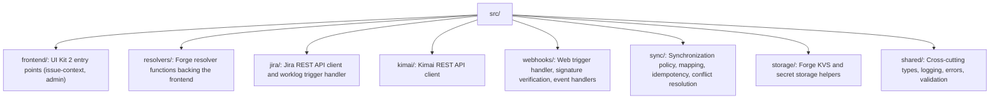
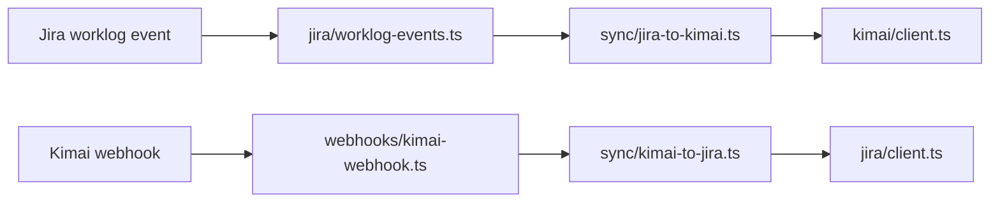

# Architecture

Instead of running our own externally-hosted server, the app runs entirely on Forge: UI
extensions, event triggers, a web trigger endpoint, storage and encrypted secrets.

## Modules (`manifest.yml`)

| Module | Purpose |
|---|---|
| `jira:issueContext` | Right-hand sidebar panel with Timer/Manual tabs, rendered with UI Kit 2 (`@forge/react`). |
| `jira:adminPage` | Site administrator configuration page. |
| `trigger` | Subscribes to `avi:jira:created/updated/deleted:worklog` events. |
| `webtrigger` | Public HTTPS endpoint that receives Kimai webhooks. |
| `function` | Backend handlers for the resolvers, trigger and web trigger. |

## Source layout

`jira/`, `kimai/` and `sync/` are intentionally separate: neither Jira- nor Kimai-specific code
implements synchronization policy directly, which keeps both integrations swappable and testable
in isolation.

## Data flow

Both directions read/write the same persistent mapping (`storage/mappings.ts`) keyed by both the
Jira worklog ID and the Kimai timesheet ID, described in
[Synchronization Model](synchronization-model.md).
