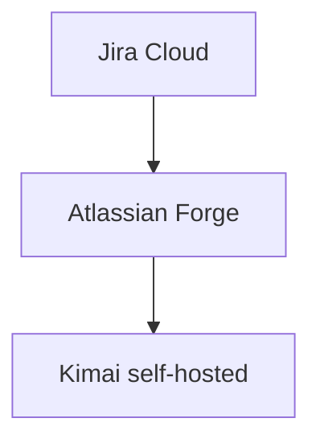
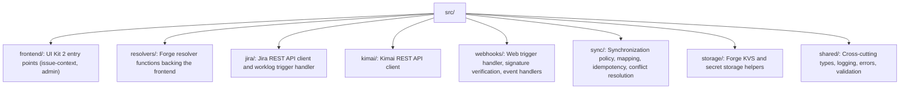
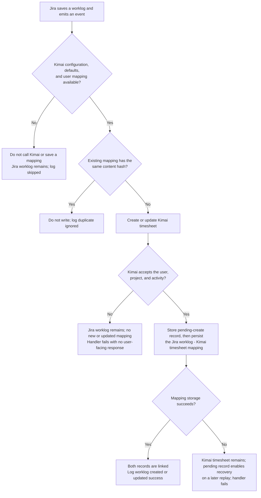
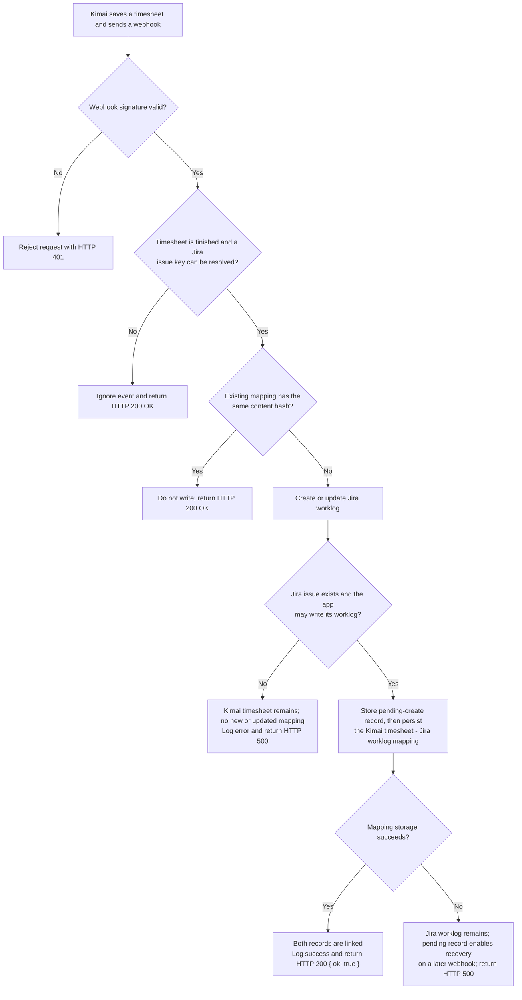

# Architecture

Instead of running our own externally-hosted server, the app runs entirely on Forge: UI
extensions, event triggers, a web trigger endpoint, storage and encrypted secrets.

## Modules (`manifest.yml`)

| Module | Purpose |
|---|---|
| `jira:issueContext` | Right-hand sidebar panel with Timer/Manual tabs, rendered with UI Kit 2 (`@forge/react`). |
| `jira:adminPage` | Site administrator configuration page. |
| `trigger` | Subscribes to `avi:jira:created/updated/deleted:worklog` events. |
| `webtrigger` | Public HTTPS endpoint that receives Kimai webhooks. |
| `function` | Backend handlers for the resolvers, trigger and web trigger. |

## Source layout

`jira/`, `kimai/` and `sync/` are intentionally separate: neither Jira- nor Kimai-specific code
implements synchronization policy directly, which keeps both integrations swappable and testable
in isolation.

## Data flow

Synchronization is not a distributed transaction. A Jira worklog or Kimai timesheet is already
saved in its source system before the integration receives its event. A failure therefore never
rejects or deletes that source record. The integration considers a change synchronized only after
the target API call and mapping persistence both succeed.

### Jira worklog to Kimai timesheet

If the configured Kimai project, activity, or user does not exist, Kimai rejects the request. The
Jira worklog remains unchanged and no new mapping is saved. Jira event handlers do not return a
user-facing success message; successful and skipped outcomes are recorded in Forge logs, while a
target failure causes the handler to fail.

### Kimai timesheet to Jira worklog

If the referenced Jira issue or its project does not exist, or the app lacks permission to add a
worklog, Jira rejects the request. The Kimai timesheet remains unchanged and unmapped; the webhook
receives a safe HTTP 500 error response so the failure is visible to Kimai and Forge logs.

Both directions use the same persistent mapping (`storage/mappings.ts`), indexed by Jira worklog
ID and Kimai timesheet ID. Pending-create records make a replay recover from a mapping-storage
failure after the target record was created; they are recovery markers, not a cross-system rollback.
See [Synchronization Model](synchronization-model.md) for idempotency and loop prevention.
