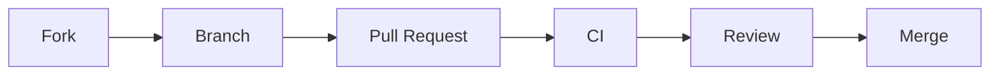

# Development

## Setup

```bash
git clone https://github.com/jacksonpradolima/kimai-jira.git
cd kimai-jira
npm ci
```

No production Forge or Kimai credentials are required for `npm ci`, `npm run lint`,
`npm run typecheck` or `npm test`.

## Dev Container

The repository includes a reproducible [Dev Container](https://containers.dev/) for VS Code and
GitHub Codespaces. It pins Node.js 22, installs the Playwright browser required for UI-document
checks, installs the documentation tooling, and enables the repository Git hooks.

Open the repository with **Dev Containers: Reopen in Container**. The initial setup runs
automatically; subsequent shell sessions can use the `make` targets below.

## GitHub Actions runner requirements

GitHub-hosted runners require no additional setup. When using self-hosted runners, install
Actions Runner `v2.327.1` or later. The Dependency Review action runs on Node.js 24 from v5.0.0,
which requires that runner version. This is independent of the project runtime: local development
and the application's CI jobs use Node.js 22.

## Common development tasks

The `Makefile` provides concise commands in the Dev Container and CI (or any environment with
GNU Make installed):

```bash
make install      # npm ci
make check        # lint, typecheck, unit tests, and UI-doc verification
make coverage     # Jest coverage report
make docs         # strict Zensical build
make ci           # all repository checks, including docs
```

`make help` lists every available target.

Outside the Dev Container, install the Playwright browser once before running UI-document checks:

```bash
npx playwright install chromium
```

## Registering your own Forge app

The `manifest.yml` in this repository contains a placeholder `app.id`. To develop against your own
Atlassian developer environment:

```bash
npx forge login
npx forge register kimai-for-jira
```

`forge register` updates `manifest.yml` with an app id scoped to your own account — this never
touches the maintainer's production app.

## Deploying to a development environment

```bash
npx forge deploy
```

By default this deploys to the `development` Forge environment. Use `--environment staging` or
`--environment production` for other environments once you control them.

## Installing on a demo site

```bash
npx forge install --demo-site
```

This creates (or reuses) a disposable Atlassian site for testing, so you never need access to a
real company Jira site during development.

## Live reload while developing the UI/resolvers

```bash
npx forge tunnel
```

## Linting Forge-specific issues

```bash
npx forge lint
```

`forge lint` requires being logged in to *some* Atlassian account (see `npx forge login`), but
never requires the maintainer's production credentials. CI runs this step only when a dedicated,
non-production CI account's credentials are available as repository secrets, and treats failures
as non-blocking for pull requests that don't have access to those secrets (e.g. from forks).

## Repository structure

See [Architecture](architecture.md#source-layout).

## Working on the documentation

Documentation lives under `/docs` and is built with [Zensical](https://zensical.org/) from
`zensical.toml`.

```bash
pip install -r docs/requirements.txt
zensical serve -f zensical.toml
```

This serves the docs locally with live reload. To reproduce the CI check:

```bash
zensical build -f zensical.toml --clean --strict
```

The generated `site/` output is git-ignored and must never be committed.

## Commit workflow



Deployment to any real Forge installation is a separate, maintainer-triggered GitHub Actions
workflow (`.github/workflows/deploy.yml`) and never runs automatically from a pull request.

## Commit and release workflow

Install the local checks once when not using the Dev Container:

```bash
python3 -m pip install --user pre-commit
python3 -m pre_commit install --install-hooks
```

The hooks reject whitespace errors, merge-conflict markers, oversized files, failed repository
checks, and commit messages that do not follow Conventional Commits. Pull request titles follow
the same convention.

On `main`, semantic-release determines the next semantic version from Conventional Commit types,
updates `CHANGELOG.md`, `package.json`, and `package-lock.json`, creates a `vX.Y.Z` tag, and
publishes a GitHub Release. The project remains private and is **not** published to npm. Forge
deployment remains a separate, manually dispatched workflow.
