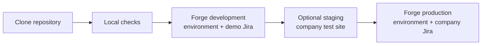

# Run locally, test in Forge, and roll out to your company

This is the end-to-end guide for taking this repository from a fresh clone to a
working installation on a company Jira Cloud site. Follow the sections in order:
first prove the code locally, then test it on a disposable Forge/Jira site, then
deploy it to your company.

## Choose the right environment

Keep the three stages separate. A Forge app has independent **development**,
**staging**, and **production** environments. A development installation is labelled
`(DEVELOPMENT)` in Jira; it is for testing and is not the company rollout.



| Stage | Forge environment | Jira site | Who uses it |
|---|---|---|---|
| Local checks | None | None | Developer |
| Safe end-to-end test | Development | Your Forge demo site | Developer/testers |
| Pre-release test | Staging | A non-production company Jira site | Testers/admins |
| Company rollout | Production | The company Jira Cloud site | Company users |

Do not point a development installation at the production Kimai instance unless your
company has explicitly approved that test. Prefer a separate Kimai test instance or
test account and project.

## Before you start

You need the following people or permissions. One person can hold more than one role.

| Role | Needed for |
|---|---|
| Forge app owner | Logging in, registering the company-owned app, and deploying it |
| Jira site administrator | Installing/upgrading the app on the company site and opening its admin page |
| Kimai administrator | Ensuring Kimai is reachable and adding the outbound webhook |
| Each Jira user | Creating their own Kimai API token in the issue panel |

You also need:

- Node.js 22 (`node --version` should report `v22.x`);
- npm (bundled with Node);
- an Atlassian developer account for the development test. It does not need access to
  the company Jira site;
- a self-hosted Kimai URL that Forge can reach over HTTPS. It must use a valid public
  TLS certificate and must not be reachable only on a private LAN/VPN.

For a company deployment, create or use a company-owned Forge developer account or
developer space. Do not make a personal Forge app the long-term owner of a company
integration: the owner controls deployments, environments, and access to app data.

## 1. Clone and verify the repository locally

```bash
git clone https://github.com/jacksonpradolima/kimai-jira.git
cd kimai-jira
npm ci
npm run lint
npm run typecheck
npm test
```

These commands run the static checks and unit tests only. They do **not** call Forge,
Jira, or Kimai, and they do not require secrets.

If you also want the full repository check (including generated UI documentation), run:

```bash
npx playwright install chromium
npm run check
```

## 2. Create your own Forge app for testing

The checked-out `manifest.yml` intentionally contains a placeholder app ID. The first
time you use this source code, register a new app under your own Forge account:

```bash
npx forge login
npx forge settings set usage-analytics false
npx forge register kimai-for-jira-dev
```

`forge register` writes a new app ID to `manifest.yml`. That app and its data belong
to the account that ran the command; it does not affect this repository's maintainer
or their Forge app.

Register **once** for an app. Running `forge register` again generates a different app
ID and disconnects the local manifest from the previous app's environments, variables,
and storage. Keep the resulting `manifest.yml` local to this development/company
deployment clone; do not commit an app ID or a company hostname back to this public
repository.

### Allow Forge to call Kimai

Before deploying, replace the placeholder in `manifest.yml` with the hostname of the
Kimai server for this environment:

```yaml
permissions:
  external:
    fetch:
      backend:
        - https://kimai-test.example.com
```

Forge denies outbound network calls unless the host is listed there. Use only the
scheme and hostname—never place an API token, password, or other credential in this
file. A different Kimai hostname requires a manifest change followed by another
deployment and, in production, may require a Jira administrator to approve the app
upgrade.

## 3. Deploy and test on a Forge demo Jira site

Deploy to the default development environment and install it on a disposable demo
site:

```bash
npx forge lint
npx forge deploy --environment development
npx forge install --environment development --demo-site
```

The install command provisions or reuses a demo Jira site. It is safe for development
and does not install anything in your company Jira. After installation:

1. Open the demo Jira site and create or open an issue.
2. Confirm that the **Kimai (DEVELOPMENT)** issue panel appears in the issue view.
3. Open **Jira administration → Apps → Kimai Integration**.
4. Enter the test Kimai base URL. Optionally set default Kimai project and activity IDs
   for Jira-to-Kimai worklog synchronization.
5. Return to an issue, select **Manage Kimai connection**, and enter a Kimai API token
   for a test user.
6. Start/stop a timer or create a manual entry. Confirm that the expected Kimai
   timesheet is created.

For iterative code changes, keep this command running in a separate terminal:

```bash
npx forge tunnel --environment development
```

With a tunnel running, invocations from the development installation use your local
code. Deploy again before testing a change without the tunnel, before using staging,
or before promoting the change to production. Forge tunnels are not available in
staging or production.

### Test Kimai → Jira synchronization

The Kimai-to-Jira direction needs an inbound webhook:

1. In **Kimai Integration**, select **Generate webhook secret** and copy it now; it is
   only displayed once.
2. Copy the Forge web-trigger URL displayed on the same admin page.
3. In the Kimai test instance, create a webhook for `timesheet.created` and
   `timesheet.updated` that sends requests to that URL using the generated secret.
4. Create or update a Kimai timesheet associated with a Jira issue and check that the
   matching Jira worklog is created or updated.

See [Kimai Setup](kimai-setup.md) for the Kimai-side details and
[Synchronization Model](synchronization-model.md) for current synchronization behaviour.

## 4. Prepare the company rollout

Before touching the production site, agree on these decisions with the company Jira
and Kimai administrators:

- **App ownership:** the Forge app is registered under a company-controlled account or
  developer space, with more than one trusted contributor where possible.
- **Kimai endpoint:** the exact production HTTPS hostname is reachable from Forge and
  is listed in `manifest.yml`.
- **Test boundary:** the development/staging app uses non-production Kimai credentials
  and data.
- **Defaults:** decide whether Jira-created worklogs should use default Kimai project
  and activity IDs. They can be left empty if the workflow does not need them.
- **User onboarding:** each user will create and enter their own Kimai API token; an
  administrator cannot enter or read users' tokens for them.
- **Webhook owner:** a Kimai administrator is available to configure and maintain the
  webhook secret and destination URL.

Run the local checks again from the exact commit you intend to release:

```bash
npm ci
npm run check
npx forge lint
```

## 5. Deploy and install in company production

From the company-owned deployment clone, with the production Kimai hostname already
in `manifest.yml`, run:

```bash
npx forge deploy --environment production
npx forge install --environment production --site your-company.atlassian.net --product jira
```

The second command must be performed by a Jira site administrator or a Forge owner
with permission to install on that site. Carefully review the requested Forge scopes
before confirming. The production app is titled **Kimai** (without a development or
staging suffix).

If Forge reports a major-version approval, read the listed change and explicitly
approve it only if expected:

```bash
npx forge deploy --environment production --approve MAJOR_VERSION_RULE
```

Do not use `--no-verify` as a way to bypass that review.

## 6. Configure the installed company app

The Jira site administrator completes these steps after installation:

1. Open **Jira administration → Apps → Kimai Integration**.
2. Set the production **Kimai URL**. It must match the hostname declared in
   `manifest.yml`.
3. Set the optional default Kimai project/activity IDs if Jira worklogs should create
   Kimai timesheets with those defaults.
4. Select **Generate webhook secret**, store it in the company's approved secret
   manager, and copy the displayed Forge webhook URL.
5. Ask the Kimai administrator to configure the Kimai webhook with that URL and secret.
6. Test with a non-critical Jira issue and a pilot user before inviting all users.

Each user then performs their own setup:

1. Open any Jira issue and find the **Kimai** panel.
2. Select **Manage Kimai connection**.
3. Paste their personal Kimai API token and save.
4. Create a small manual time entry or start/stop a timer to confirm access.

Tokens and webhook secrets are stored in Forge Secret Store. They are not committed to
Git, exposed on the admin page after creation, or visible to other users.

## Updating an existing company installation

Use the same release order every time: local checks, development test, optional
staging test, then production deployment. For a production app already installed on
the company site:

```bash
npx forge deploy --environment production
npx forge install --environment production --site your-company.atlassian.net --product jira --upgrade
```

Keep the production Kimai hostname and Forge app ID stable. Re-running `forge register`
instead creates a different app and loses the connection to the existing app's data.

## If something does not work

- **No Kimai panel in Jira:** confirm that deployment and installation target the same
  Forge environment and site, then refresh the issue view.
- **Kimai calls fail:** confirm the URL is public HTTPS and its hostname exactly matches
  `permissions.external.fetch.backend` in `manifest.yml`; deploy again after changing
  it.
- **`forge` says you are not logged in:** run `npx forge login` using the intended
  company/development account.
- **Webhook returns 401:** regenerate/check the shared secret and signature settings;
  see [Troubleshooting](troubleshooting.md#kimai-webhook-requests-are-rejected-with-http-401).
- **Need more detail:** see [Development](development.md), [Installation](installation.md),
  [Configuration](configuration.md), and [Kimai Setup](kimai-setup.md).
