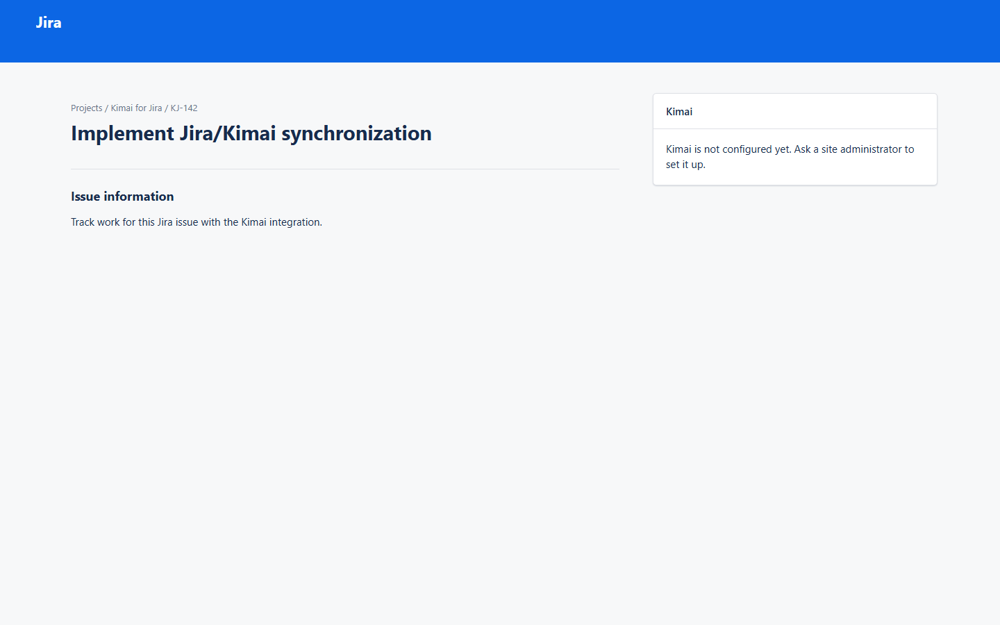
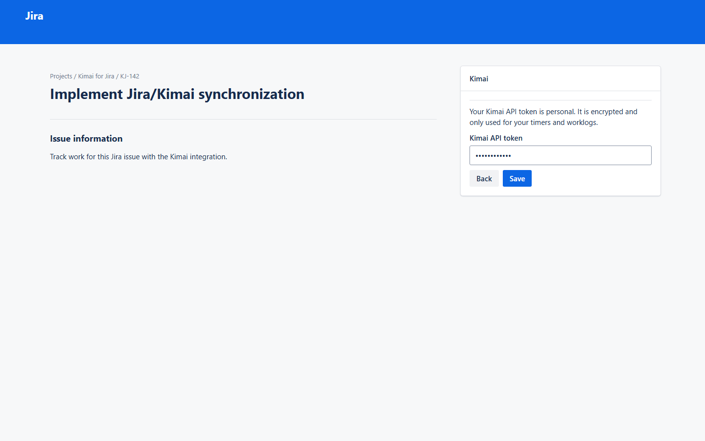
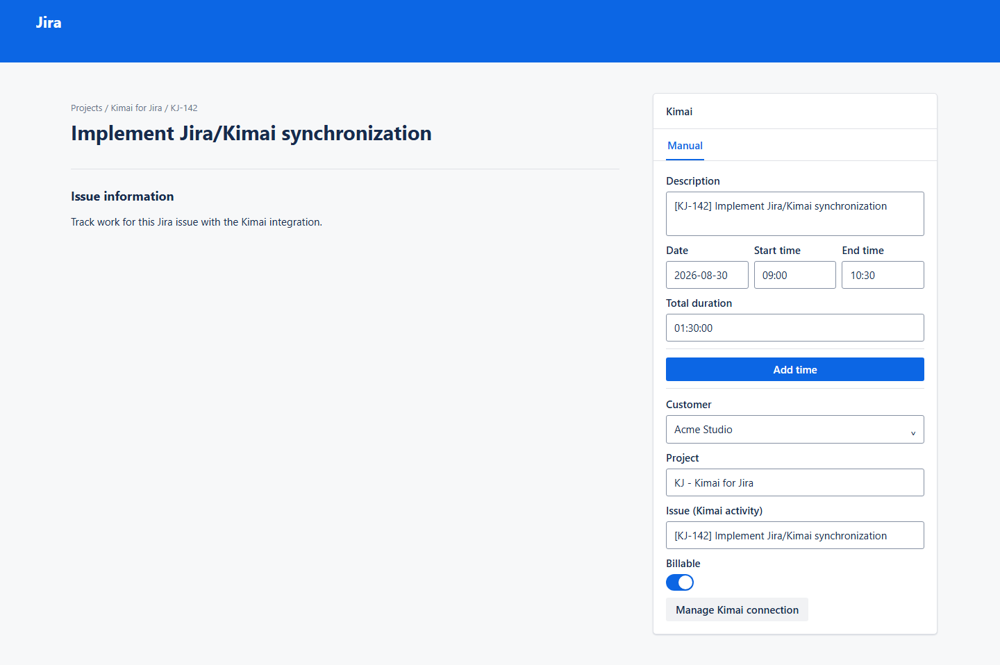
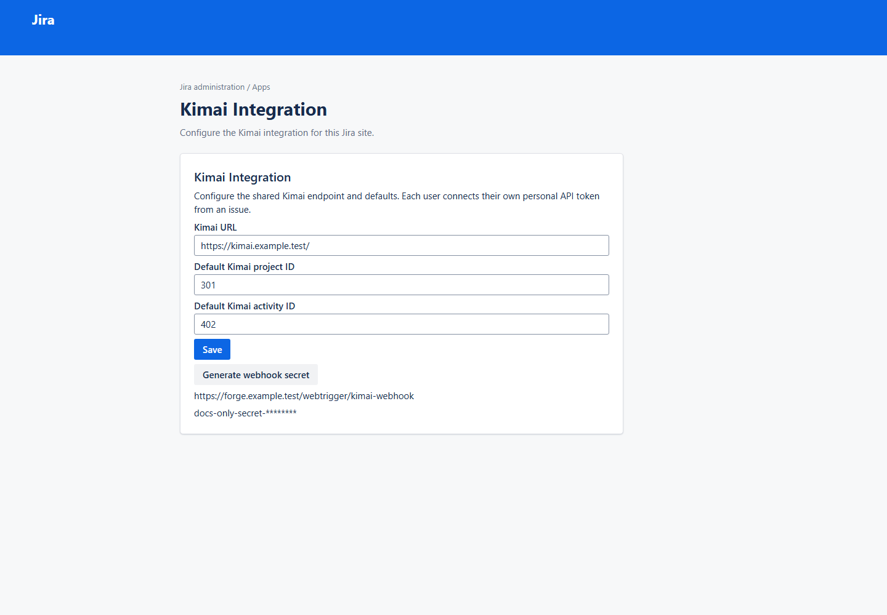

# UI documentation

This gallery is generated from the production Forge UI Kit presentation components. It provides a
reviewable visual record of the implemented issue-context and administration screens without
requiring Jira, Kimai, Forge credentials, or network access.

> **AUTO-GENERATED — DO NOT EDIT MANUALLY:** every PNG in `generated/` is produced by the UI
> documentation harness. Run `npm run docs:ui` and commit the resulting assets instead of editing
> an image.

## Implemented screens

| Screen | Status | Source |
| --- | --- | --- |
| Not configured | Implemented | `src/frontend/issue-context/IssueContextView.tsx` |
| Personal API connection | Implemented | `src/frontend/issue-context/IssueContextView.tsx` |
| Manual time entry | Implemented | `src/frontend/issue-context/IssueContextView.tsx` |
| Admin configuration | Implemented | `src/frontend/admin/AdminView.tsx` |
| Webhook | Implemented | `src/frontend/admin/AdminView.tsx` |

### Jira issue context







### Jira administration




## How it stays synchronized

`IssueContextView` and `AdminView` are the production UI Kit component trees. Their Forge entry
points retain bridge calls, state management, and resolver interactions. The documentation harness
passes deterministic fixture props to those same views, captures the Forge reconciler document, and
renders it in an original, local Jira-style shell before Playwright captures a PNG. The shell and
generic UI Kit adapter supply context only; they never reproduce individual application screens.

Administrators never enter a Kimai API token. Instead, a user opens **Manage Kimai connection** in
the issue panel and saves their personal token. The resolver validates it with Kimai's
`/api/users/me`, stores it under that Jira account in Forge Secret Store, and records the returned
Kimai user ID for timer and Jira-worklog synchronization. The raw token is never returned to the UI.

Fixtures live in `scripts/ui-docs/fixtures.tsx`. They use fictional values, fixed elapsed times,
no live requests, fixed viewports, a device scale factor of one, and disabled animations. Browser
screenshots are PNG source-of-truth because browser-rendered React cannot be exported as a faithful
semantic SVG. [Screen flows](screen-flow.md) use Mermaid instead.

## Regeneration and CI

```bash
npm run docs:ui
npm run docs:ui:check
```

`docs:ui` replaces the generated PNGs and their `manifest.json`. `docs:ui:check` recreates the
platform-independent manifest from the production Forge view trees and relevant source files. It
fails when a frontend layout, fixture, or documentation renderer change makes committed assets
stale, without comparing platform-specific browser PNG bytes. GitHub Actions runs that check after
the normal tests.
