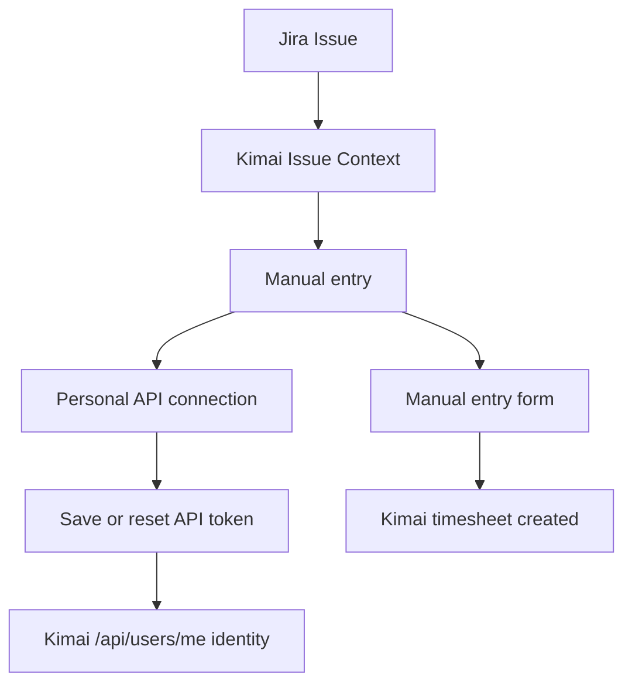
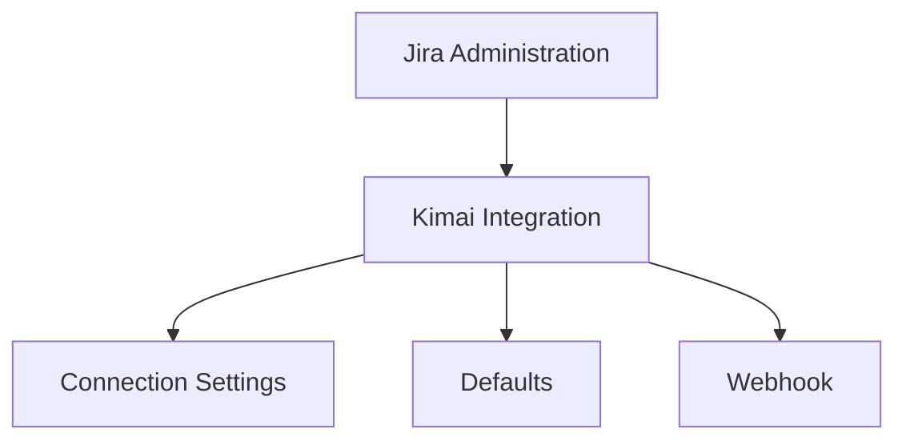

# UI screen flow

## Issue context

```mermaid
flowchart TD
  issue[Jira Issue] --> context[Kimai Issue Context]
  context --> manual[Manual entry]
  manual --> personal[Personal API connection]
  personal --> token[Save or reset API token]
  token --> identity[Kimai /api/users/me identity]
  manual --> manualForm[Manual entry form]
  manualForm --> saved[Kimai timesheet created]
```

## Administration

```mermaid
flowchart TD
  admin[Jira Administration] --> integration[Kimai Integration]
  integration --> connection[Connection Settings]
  integration --> defaults[Defaults]
  integration --> webhook[Webhook]
```

All nodes correspond to current production UI states captured in the [UI gallery](README.md).
